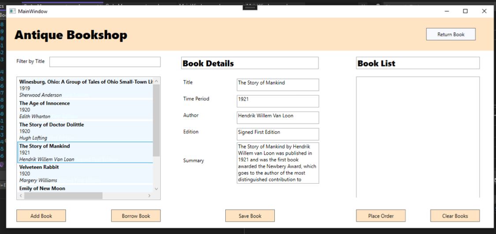
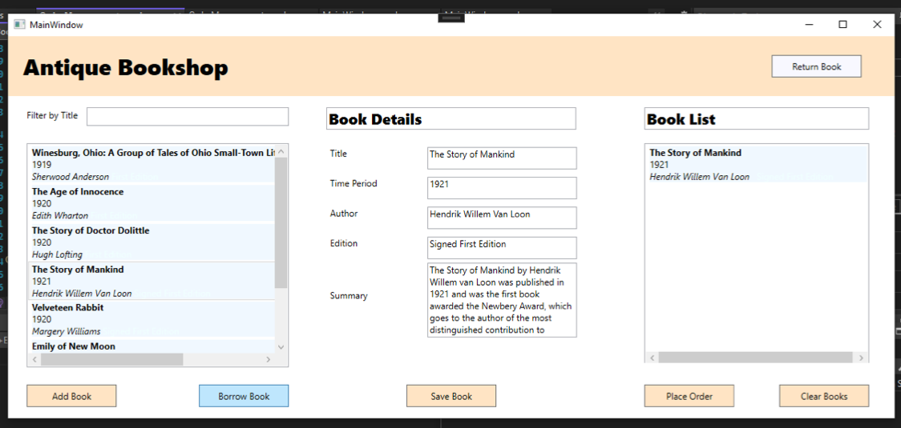
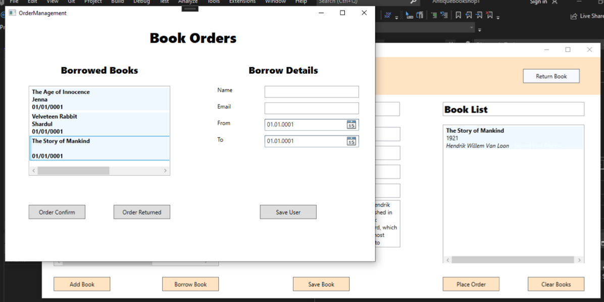
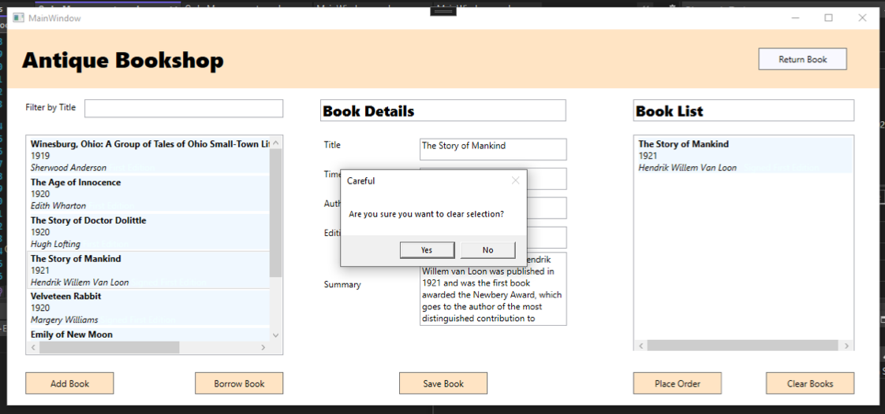

# Antique-Bookshop

A WPF desktop application.

# Application

The user of the application is an antique bookshop owner keeping tracks of all the books and their informaion, lending the books to walk-in customers, keeping record of the lended books and the borrower information, books that are available for lending and books that are returned and finally, updating the duration for which the is lended, on request.

# Process
<li>Application user and description defining</li>
<li>Application layout, following Gestalt principles</li>
<li>Book records stored in XAML, serializer for reading and writing</li>
<li>Book information display and update</li>
<li>Selecting books for borrowing</li>
<li>Moving selceted books to order queue</li>
<li>Storing user information and duration for respective books</li>
<li>Moving returned books from order queue</li>

# Images

